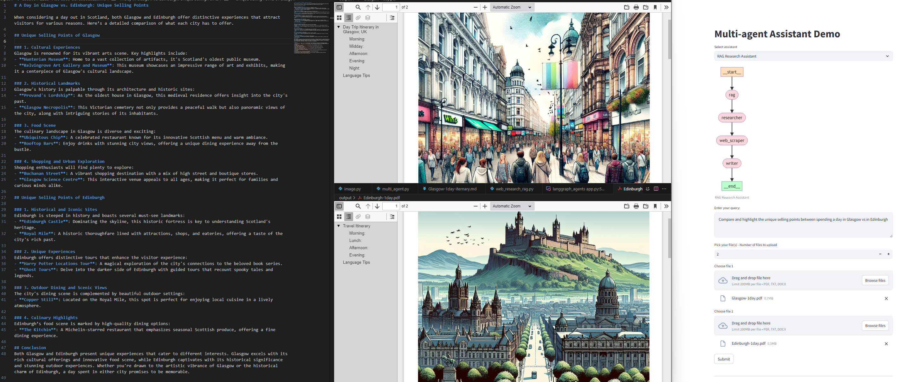
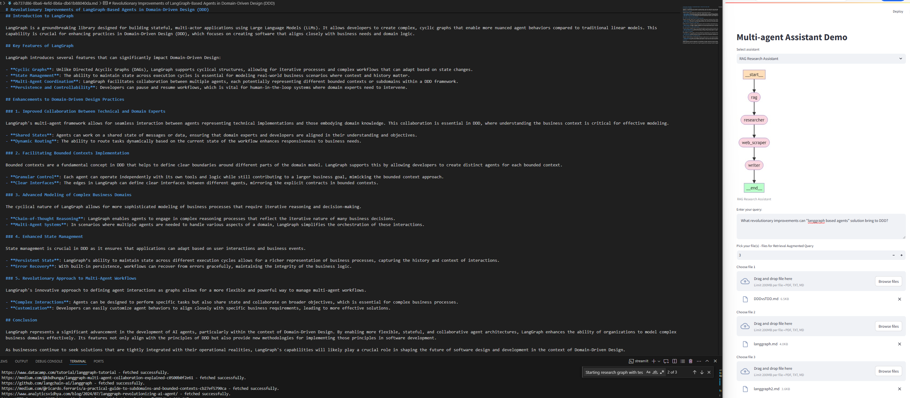

# agents
poc of langgraph based agents

Inspired by online tutorial - https://blog.finxter.com/building-complex-multi-agent-teams-and-setups-with-langgraph/
Other projects inspiration:
https://github.com/kturung/langgraph_streamlit_codeassistant/
https://github.com/msamwelmollel/ML-CLUB-2024-Eagle-Labs

*Create a .env file with following keys:
OPENAI_API_KEY=(mandatory)
LANGCHAIN_API_KEY=(mandatory)
WEATHER_API_KEY=(optional)
TAVILY_API_KEY=(mandatory)